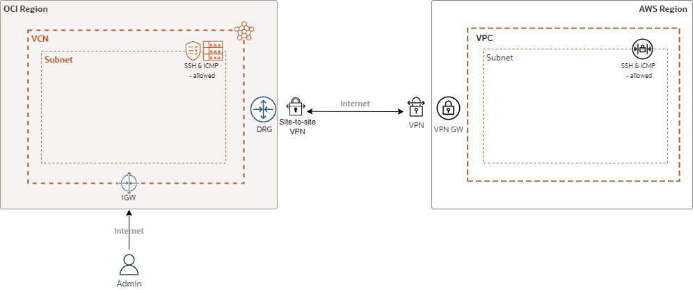

# OCI to AWS Site-to-Site VPN

This repository allows you to deploy a Site-to-Site VPN between OCI DRG and AWS VPN Gateway. 
It configures the following:

- AWS: CGW, VPN Gateway, VPC, Subnet, Route Table, NACL and NSG
- OCI: CPE, DRG, VCN, IGW, Subnet, Route Table and security list.
- ICMP and SSH is enabled between AWS and OCI.
- SSH is enabled from the administrator public IP to OCI. 

## Architecture diagram



## Requirements

- An active Oracle Cloud Infrastructure Account.
- An active AWS account
- API Key Authentication for OCI Terraform provider -> https://docs.oracle.com/en-us/iaas/Content/API/SDKDocs/terraformproviderconfiguration.htm
- Terraform
- Permission to manage the following types of resources in your Oracle Cloud Infrastructure tenancy and AWS: vcns, internet-gateways, route-tables, security-lists, subnets, VPCs, subnets, Roue Tables, NACLs, VPN Gateway.

## Steps

- Duplicate the "terraform.tfvars.template" file and rename it to "terraform.tfvars"
- In the new "terraform.tfvars" file complete the "OCI Tenancy Credentials", "Oracle Variables", "AWS Variables" and "VPN Variables"
- Authenticate to AWS. For simplicity it is recommended to do it via the AWS Toolkit (requires installation)

## Deployment

Create the Resources using the following commands:

```bash
terraform init
terraform plan
terraform apply
```

After successfully performing the "terraform apply" the administrator must connect to the AWS Portal and modify the Site-to-Site VPN selecting the New IaC CGW".
This will be the last step for completing the connection.

At this point the administrator can create EC2 and compute instances in AWS and OCI portals. 
When creating the EC2 instance in AWS be sure to select the IaC VPC and NSG.

For destroying the deployment first modify the AWS VPN to use the "IaC_CGW" instead of the "New_IaC_CGW".

Use the following command to destroy the deployment:

```bash
terraform destroy
```
